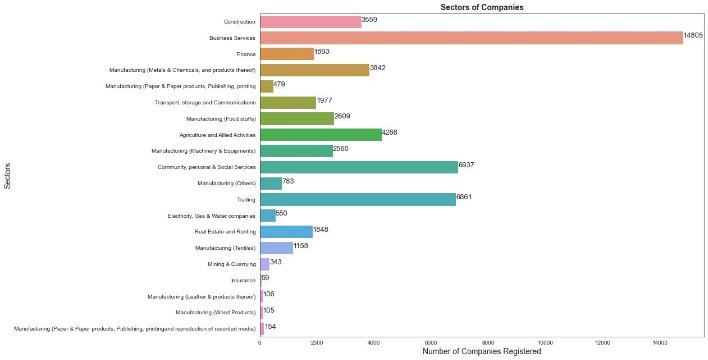
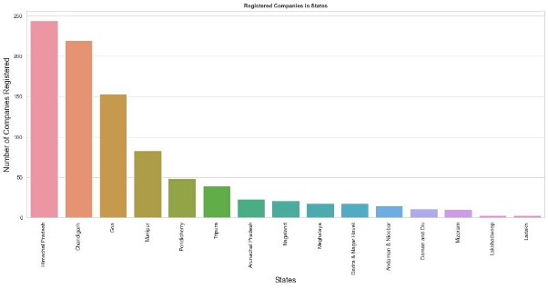
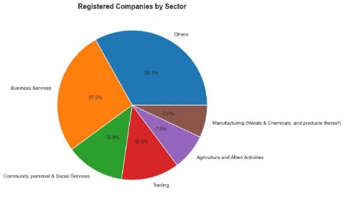
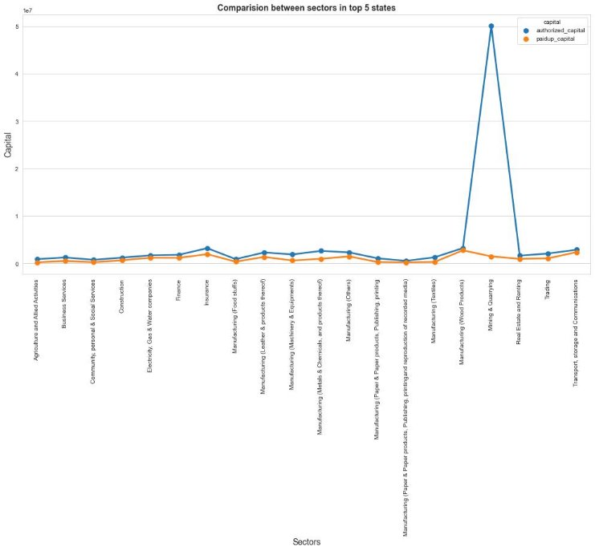
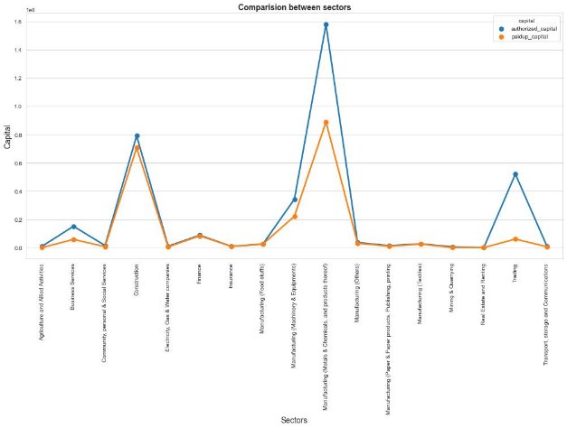
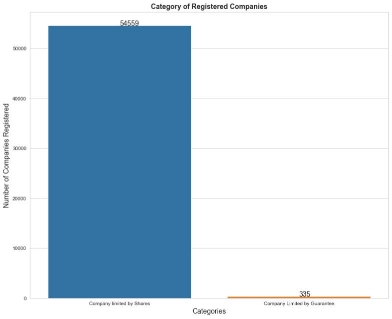
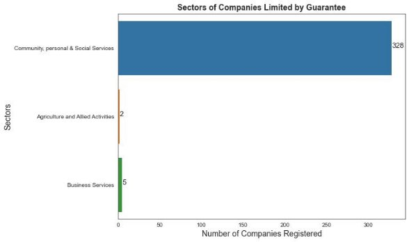

**Attributes Definition**: 

1. **company\_uid:**  Unique  identification  number  generated  for  each  registered company. 
1. **date\_of\_registration:** Date when the company was register with Ministry of Corporate Affairs (MCA). 
1. **month\_name:** Which month the company was registered. 
1. **state:** In which region/location that company was registered. 
1. **roc:** This field informs in which Registrar of Companies (RoC) the company was registered.  
1. **category:** Weather the entity is limited by shares or guarantee. 
1. **class:** Whether the entity is PRIVATE LIMITED (OPC) or PRIVATE LIMITED.  
1. **company\_type:** Whether it is run by Government or Private. 
1. **authorized\_capital:** Authorized capital is the maximum amount of capital a company is authorized to raise from its shareholders. 
1. **paidup\_capital:** Paid-up capital is the amount paid by the shareholders for the shares held by them in the company. 
1. **activity\_code:** This provides the id of the nature of business the entity is legally registered for. 
1. **activity\_description:** This provides the nature of business the entity is legally registered for. 

**Graphs:** 

This graph shows the total number of companies that were registered in each month in the given period of time. 

During January 2021 the condition of daily COVID-19 cases was just getting better and the number of companies registered in most of the days of January was between 550 to 650 approximately but there were some days when it was much lower. 

As the condition was getting better during February the number of companies registered each day increased and the consistency was good, the value even got better in March but in April the second wave of COVID-19 hit us and the number of companies registered each day decreased and the consistency also went down. 

This graph shows the comparison between the number of companies registered with different activity descriptions i.e. in different sectors. 

It shows the percentage of companies with different activity description that were registered. 

We can clearly observe the sector in which maximum number of companies were registered from the above graphs (Barplot and Pie Chart) 

We can observe from the above graph that apart from two sectors (Electricity, Gas & Water Companies and Mining & Quarrying), the difference between authorized and paid-up capital is no that much which means that they have already generated most of the capital that they can but there is a lot of capital available that can be generated in Electricity, Gas & Water Companies and Mining & Quarrying. 

If we look at the above three plots we can observe that only 1% and 0.6% of total companies  registered  were  in  Electricity,  Gas  &  Water  Companies  and  Mining  & Quarrying sectors respectively but the amount of capital left to be generated in these sectors  is  enormous,  therefore  these  sectors  have  a  lot  of  potential  for  future opportunities provided people can come up with new innovative ideas to make proper use of this potential. 

This  graph  shows  the  number  of  companies  registered  in  each  state  and  Union Territory with the top 5 states being Maharashtra, Uttar Pradesh, Delhi, Karnataka and Telangana. 

This is a zoomed in version of the States and Union Territories with least registered 

companies. 

Companies Registered in TOP 5 States:- 

This shows the percentage of companies registered in different sectors in the states with top 5  number of companies registered. 

Companies registered in whole country :- 

If we compare the pie chart for top 5 states with the similar pie chart that we created for the whole country, we can observe that the national trends are reflected in these states while talking about the number of companies registered  in each sector. 

This graph shows the trends of authorized and paid-up capitals of companies in the top 5 states. We can observe that there is a very less difference between authorized and paid-up capitals in almost every sector as compared to the data of all the states and also the difference for Electricity, Gas & Water Companies is significantly lower. This is due to the fact that most of the big companies are located in these places and also there is a lot of competition in these places.  

Mining and Quarrying still have a lot of potential capital to be generated in these states as compared to other sectors.  

This barplot compares the number of companies registered in each RoC. 

We can observe that the top five RoC are from the top 5 states and therefore, we can conclude that the trends that we observed for these stats are reflected on these RoC too. 

` `This plot shows all the sectors in which new subsidiaries of foreign companies have been registered. We can observe that the maximum investments are made in the Business Services Sectors by foreign companies. 

This Jitter Plot shows the paid-up capitals of all the companies of the dataset with different colours for different types of companies. 

We can observe that most of the foreign companies have more paid-up capital than Indian companies, since more that 65% of foreign companies are in Business Services sector and their paid-up capitals are more than most of the other companies, we can conclude that foreign companies are performing quite well in India. 

This  shows  the  difference  between  authorized  and  paid-up  capitals  of  foreign companies. We can observe that for most of the sectors,  authorized and paid-up capitals are same but in Business services there is a good difference between them indicating potential of growth in this sector for foreign companies. 

This plot shows that more than 99% of the companies are limited by share in Indian. This is because of the fact that these companies make profits but a company limited by guarantee is a non-profit company. 

This scatter plot shows that none of the subsidiaries of foreign companies and Union Government Companies are limited by guarantee. 

From this plot, we can observe that more than 99% of the companies limited by guarantee are in the Community, personal & Social Services sector because these companies are generally non-profit companies. 
