**Review-2,3                 CSE3020-Data Visualization** 

**Slot: D1             Faculty: Lydia Jane G** 

**Indian Startups-2021** 

**Dataset URL-[ https://drive.google.com/file/d/1_ST97Tc2dILzk- w_JaUsw9k9k_bSd4XE/view?usp=sharing** ](https://drive.google.com/file/d/1_ST97Tc2dILzk-w_JaUsw9k9k_bSd4XE/view?usp=sharing)**

**Video URL-[ https://drive.google.com/file/d/1ftC49vromeJtH- dUqvJdR__3VtmTxbVW/view?usp=sharing**](https://drive.google.com/file/d/1ftC49vromeJtH-dUqvJdR__3VtmTxbVW/view?usp=sharing)**

**Submitted by: Satwik Tanwar (20BCE2945)** 

**Code:** 

Python  language  has  been  used  to  write  the  code  with  help  of  following libraries: 

1. *Pandas*: Used for importing and manipulating data. 
1. *Plotly*: Used for creating interactive visualizations. 
1. *Dash*: Used for creating the dashboard 

import pandas as pd 

import plotly.express as px 

from plotly.subplots import make\_subplots 

import plotly.graph\_objects as go 

from dash import html 

from dash import dcc 

from jupyter\_dash import JupyterDash 

import dash 

from dash.dependencies import Input, Output companies=pd.read\_csv('2021\_registered\_companies.csv') foreign=companies[companies['company\_type']=='Subsidiary of Foreign Company'] month\_date=pd.DataFrame(companies['date\_of\_registration'].value\_counts()) 

month\_date.reset\_index(inplace=True) 

month\_date['month']='month' 

month\_date.sort\_values('index',inplace=True) 

month\_date\_fr=pd.DataFrame(foreign['date\_of\_registration'].value\_counts()) month\_date\_fr.reset\_index(inplace=True) 

month\_date\_fr['month']='month' month\_date\_fr.sort\_values('index',inplace=True) 

def assign\_month(df): 

`    `for i in range(0,len(df.index)):         if '/01' in df.loc[i,'index']:             df.loc[i,'month']='Jan-21'         elif '/02' in df.loc[i,'index']:             df.loc[i,'month']='Feb-21'         elif '/03' in df.loc[i,'index']:             df.loc[i,'month']='Mar-21' 

`        `elif '/04' in df.loc[i,'index']: 

`            `df.loc[i,'month']='Apr-21'             assign\_month(month\_date) assign\_month(month\_date\_fr)

companies\_activity=companies.pivot\_table(index='activity\_description',values=['paidup\_capital','authoriz ed\_capital']) 

companies\_activity.reset\_index(inplace=True) 

capitals = companies\_activity.melt('activity\_description', var\_name='capital',  value\_name='vals') 

companies\_activity\_fr=foreign.pivot\_table(index='activity\_description',values=['paidup\_capital','authorize d\_capital']) 

companies\_activity\_fr.reset\_index(inplace=True) 

capitals\_fr = companies\_activity\_fr.melt('activity\_description', var\_name='capital',  value\_name='vals') 

sectors=pd.DataFrame(companies['activity\_description'].value\_counts()) sectors.reset\_index(inplace=True) sectors\_fr=pd.DataFrame(foreign['activity\_description'].value\_counts()) sectors\_fr.reset\_index(inplace=True) 

state\_data=pd.DataFrame(companies['state'].value\_counts()) state\_data.reset\_index(inplace=True) state\_data.rename(columns={'index':'State','state':'Companies\_Registered'}, inplace = True) fig = px.choropleth( 

`            `state\_data, 

geojson="https://gist.githubusercontent.com/jbrobst/56c13bbbf9d97d187fea01ca62ea5112/raw/e388c4 cae20aa53cb5090210a42ebb9b765c0a36/india\_states.geojson", 

`            `featureidkey='properties.ST\_NM', 

`            `locations='State', 

`            `color='Companies\_Registered', 

`            `color\_continuous\_scale='Reds', height=700 

`            `) 

fig=fig.update\_geos(fitbounds="locations", visible=True) 

external\_stylesheets = ['https://codepen.io/chriddyp/pen/bWLwgP.css'] 

app = JupyterDash(\_\_name\_\_, external\_stylesheets=external\_stylesheets)     #initializing the app server=app.server                                                          #creating server variable 

app.layout = html.Div([ 

`    `html.H1([ 

`        `"Indian Startups-2021" 

`    `],style={'background': '#6392e7','padding':'20px 20px 0px 20px','margin':'0','text-align':'center'}), 

`    `dcc.Tabs(id='tabs', value='bar', children=[ 

`        `dcc.Tab(label='Bar Charts', value='bar',style={'background':'#6392e7','border-style':'none'}), 

`        `dcc.Tab(label='Geographical Plot', value='geo',style={'background':'#6392e7','border - style':'none'}), 

`        `dcc.Tab(label='Other Charts', value='other',style={'background':'#6392e7','border-style':'none'}), 

],style={'font-size':'20px'}), html.Div(id='plots') 

],style={'backgroundColor': '#f5f4f0','margin':'0' }) 

@app.callback( 

`    `Output('plots', 'children'), 

`    `Input('tabs', 'value') 

) 

def render\_content(tab): 

`    `if tab == 'bar': 

`        `return  html.Div([       #row         html.Div([               #col 1             html.Div([           #box 1 

`                `dcc.Tabs(id='bar', value='month\_name',vertical=True, children=[ 

`                `dcc.Tab(label='Month', value='month\_name', 

`                        `style={'backgroundColor':'#B0B0B0','border-style':'none'}), 

`                `dcc.Tab(label='States', value='state', 

`                        `style={'backgroundColor':'#B0B0B0','border-style':'none'}), 

`                `dcc.Tab(label='Registrar of Companies (ROC)', value='roc', 

`                        `style={'backgroundColor':'#B0B0B0','border-style':'none'}), 

`                `dcc.Tab(label='Category', value='category', 

`                        `style={'backgroundColor':'#B0B0B0','border-style':'none'}), 

`                `dcc.Tab(label='Class', value='class', 

`                        `style={'backgroundColor':'#B0B0B0','border-style':'none'}), 

`                `dcc.Tab(label='Company Type', value='company\_type', 

`                        `style={'backgroundColor':'#B0B0B0','border-style':'none'}), 

`                `dcc.Tab(label='Activity', value='activity\_description', 

`                        `style={'backgroundColor':'#B0B0B0','border-style':'none','margin-bottom':'15px'})                 ]), 

`                `dcc.RadioItems( 

`                            `id='type\_toggle', 

`                            `options=[{'label': 'All', 'value': 'all'}, 

{'label': 'Foreign', 'value': 'foreign'} 

], 

`                            `value='all', 

`                            `labelStyle={'display': 'inline-block'} 

`                `) 

`            `],style={'text-align': 'center','font-size':'16px','padding':'15px','margin':'0'}) #box 1 close         ],style={'width':'20%','backgroundColor':'#B0B0B0'}),                                  #col 1 close 

`        `html.Div([                                 #col 2             html.Div([                             #box 2                 dcc.Graph(id='Graph3'), 

`                `dcc.Slider( 

`                    `id='no\_of\_states\_slider', 

`                    `min=1, 

`                    `value=5, 

`                    `step=4) 

`            `],style={ 'padding':'15px'})              #box 2 close 

`        `],style={'width':'80%'}),                     #col 2 close 

`    `],style={'display': 'flex','row-gap': '30px'})    #row close 

`    `elif tab == 'geo': 

`        `return html.Div([ 

`            `dcc.Graph(id='geo',figure=fig)         ]) 

`    `elif tab == 'other': 

`        `return html.Div([        #row 

`            `html.Div([           #col 1                 html.Div([       #box 1 

`                    `dcc.Tabs(id='other\_graphs', value='line',vertical=True, children=[                         dcc.Tab(label='Line Chart', value='line', 

`                            `style={'backgroundColor':'#B0B0B0','border-style':'none'}),                         dcc.Tab(label='Pie Chart', value='pie', 

`                            `style={'backgroundColor':'#B0B0B0','border-style':'none'}), 

]), 

`                    `dcc.RadioItems( 

`                        `id='type', 

`                        `options=[{'label': 'All', 'value': 'all'}, 

{'label': 'Foreign', 'value': 'foreign'}                                 ], 

`                        `value='all', 

`                        `labelStyle={'display': 'inline-block'} 

) 

`                `],style={'text-align': 'center','font-size':'16px','padding':'15px','margin':'0'}) #box 1 close             ],style={'width':'20%','backgroundColor':'#B0B0B0'}),                                  #col 1 close 

`            `html.Div([                                 #col 2 

`                `html.Div([                             #box 2 

`                    `dcc.Graph(id='other\_graph'), 

`                `],style={ 'padding':'15px'})              #box 2 close             ],style={'width':'80%'}),                     #col 2 close 

],style={'display': 'flex','row-gap': '30px'})    #row close 

@app.callback( 

`    `Output('Graph3','figure'), 

`    `Output('no\_of\_states\_slider','max'), 

`    `Output('no\_of\_states\_slider','marks'), 

`    `Input('no\_of\_states\_slider','value'), 

`    `Input('bar', 'value'), 

`    `Input('type\_toggle','value') 

) 

def plots\_bar(num,bar,toggle\_type):

`    `df=pd.DataFrame(companies[bar].value\_counts().head(num))

`    `df\_foreign=pd.DataFrame(foreign[bar].value\_counts().head(num))

`    `if bar=='month\_name':         if toggle\_type=='all': 

`            `index\_feb=list(month\_date[month\_date['month']=='Feb-21'].index)             index\_mar=list(month\_date[month\_date['month']=='Mar-21'].index)             index\_apr=list(month\_date[month\_date['month']=='Apr-21'].index) 

`            `if num==1: month\_date.drop(index\_feb+index\_mar+index\_apr,inplace=True)             if num==2: month\_date.drop(index\_mar+index\_apr,inplace=True) 

`            `if num==3: month\_date.drop(index\_apr,inplace=True) 

`            `fig = make\_subplots(rows=1, cols=2) 

`            `fig.add\_trace( 

`                `go.Bar(x=df.reindex(['Jan-21','Feb-21','Mar-21','Apr-21']).reset\_index()['index'], 

`                       `y=df.reindex(['Jan-21','Feb-21','Mar-21','Apr-21']).reset\_index()['month\_name']),                 row=1, col=1 

`            `) 

`            `fig.add\_trace( 

`                `go.Box(x=month\_date['month'],y=month\_date['date\_of\_registration']),                 row=1, col=2 

`            `) 

`            `fig.update\_xaxes(title\_text="Month", row=1, col=1) 

`            `fig.update\_xaxes(title\_text="Month", row=1, col=2) 

`            `fig.update\_yaxes(title\_text="Number of Companies Registered", row=1, col=1) 

`            `fig.update\_yaxes(title\_text="Number of Companies Registered in a day", row=1, col=2)             fig.update\_layout(height=700, showlegend=False) 

if toggle\_type=='foreign': 

`            `index\_feb=list(month\_date\_fr[month\_date\_fr['month']=='Feb-21'].index)             index\_mar=list(month\_date\_fr[month\_date\_fr['month']=='Mar-21'].index)             index\_apr=list(month\_date\_fr[month\_date\_fr['month']=='Apr-21'].index) 

`            `if num==1: month\_date\_fr.drop(index\_feb+index\_mar+index\_apr,inplace=True)             if num==2: month\_date\_fr.drop(index\_mar+index\_apr,inplace=True) 

`            `if num==3: month\_date\_fr.drop(index\_apr,inplace=True) 

`            `fig = make\_subplots(rows=1, cols=2) 

`            `fig.add\_trace( 

`                `go.Bar(x=df\_foreign.reindex(['Jan-21','Feb-21','Mar-21','Apr-21']).reset\_index()['index'], 

`                       `y=df\_foreign.reindex(['Jan-21','Feb-21','Mar-21','Apr-21']).reset\_index()['month\_name']), 

`                `row=1, col=1             ) 

`            `fig.add\_trace(                go.Box(x=month\_date\_fr['month'],y=month\_date\_fr['date\_of\_registration']),                 row=1, col=2 

`            `) 

`            `fig.update\_xaxes(title\_text="Month", row=1, col=1) 

`            `fig.update\_xaxes(title\_text="Month", row=1, col=2) 

`            `fig.update\_yaxes(title\_text="Number of Companies Registered", row=1, col=1) 

`            `fig.update\_yaxes(title\_text="Number of Companies Registered in a day", row=1, col=2) 

`            `fig.update\_layout(height=700, showlegend=False) 

`    `else: 

`        `if toggle\_type=='all': 

`            `fig=px.bar(df,y=bar,height=700, 

`                       `labels={'index':bar,bar:'Number of Companies Registered'}) 

`        `if toggle\_type=='foreign': 

`            `fig=px.bar(df\_foreign,y=bar,height=700, 

`                       `labels={'index':bar,bar:'Number of Companies Registered'}) 

maximum=companies[bar].nunique()

marks={str(num): str(num) for num in range(1,maximum+1)} return fig,maximum,marks 

@app.callback( 

`    `Output('other\_graph','figure'), 

`    `Input('other\_graphs', 'value'), 

`    `Input('type','value') 

) 

def plot\_others(other\_graphs,type):     if other\_graphs == 'line': 

`        `if type=='all': 

`            `fig=px.line(capitals,x="activity\_description", y="vals",color='capital',height=800) 

`        `if type=='foreign': 

`            `fig=px.line(capitals\_fr,x="activity\_description", y="vals",color='capital',height=800)     if other\_graphs == 'pie': 

`        `if type=='all': 

`            `fig=px.pie(sectors,values='activity\_description',names='index') 

`        `if type=='foreign': 

`            `fig=px.pie(sectors\_fr,values='activity\_description',names='index') 

`    `return fig 

app.run\_server(port=8080,debug=True) 

**Screenshots and Explanation(Dashboard and Interactive Plots): *Dashboard:*** 

The dashboard contains three tabs named Bar Charts, Geographical Plot and Other Charts. Every chart in the Bar Chart section has a slider below it to select the number of bars that the user wants to display. There is also a radio button to switch between visualizing data for all the companies or only for subsidiaries of foreign companies that were registered between January 2021 and April 2021,  this  feature  is  added  to  have  a  better  understanding  about  foreign investment trends in India. 

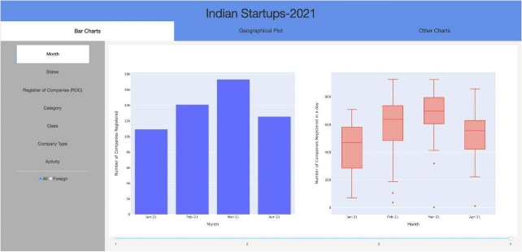

*Fig 1: Bar Chart Tab* 

*Fig 2: After selecting Foreign button* 

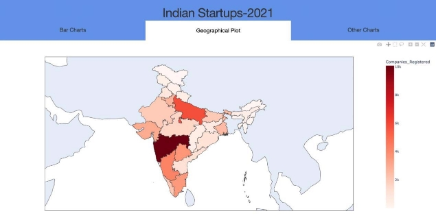

*Fig 3: Geographical Plot Tab* 

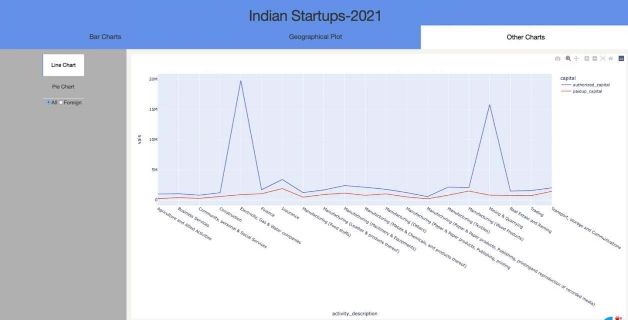

*Fig 4: Other Charts Tab* 

**Interactive Plots:** 

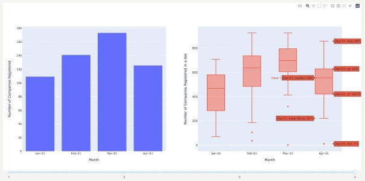

*Fig 5: Monthly trends for registered companies (All Companies)* 

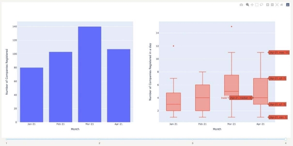

*Fig 6: Monthly trends for registered companies (Foreign Companies only)* 

This *Bar Graph* shows the total number of companies that were registered in each month in the given period of time. During January 2021 the condition of daily COVID-19 cases was just getting better and the number of companies registered in most of the days of January was between 300 to 600 approximately (from *Box Plot).* 

As the condition was getting better during February the number of companies registered each day increased and the value even got better in March but in April  the  second  wave  of  COVID-19  hit  us  and  the  number  of  companies registered each day decreased significantly. 

The same trends have been reflected for **Foreign Investments** in India too. 

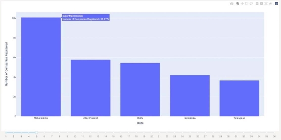

*Fig 7: Companies Registered in each state (Slider at 5 i.e. top 5 states are displayed)* 

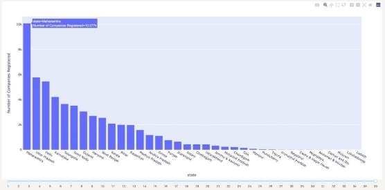

*Fig 8: Companies Registered in each state (Slider at 36 i.e. all states are displayed)* 

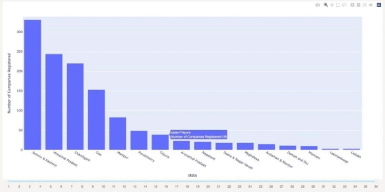

*Fig 9: Zoomed for states with less registered companies* 

These graphs show the number of companies registered in each state and Union Territory  with  the  top  5  states  being  Maharashtra,  Uttar  Pradesh,  Delhi, Karnataka and Telangana. 

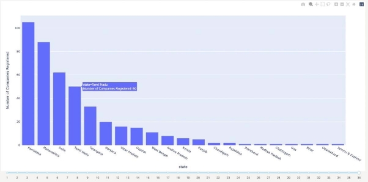

*Fig 10: Foreign Companies Registered in each state (all states)* 

On the contrary, the top 5 states where foreign companies registered are Karnataka, Maharashtra, Delhi, Tamil Nadu and Telangana. 

*Fig 11: Companies Registered in each Registrar of Companies (RoC)* 

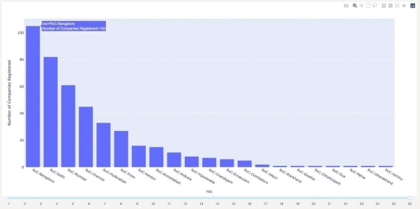

*Fig 12:Foreign Companies Registered in each Registrar of Companies (RoC).* 

This *bar chart* compares the number of companies registered in each RoC. We can observe that the top five RoC are from the top 5 states for all companies including foreign companies too and therefore, we can conclude that the trends that we observed for these stats are reflected on these RoC. 

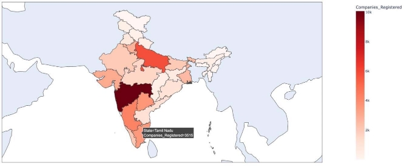

*Fig 13: Geographical Plot of companies registered in each state and union territory.* 

From this Geographical Plot we can clearly observe that Maharashtra, Uttar Pradesh, Delhi, Karnataka and Telangana have more number of companies registered than other states. 

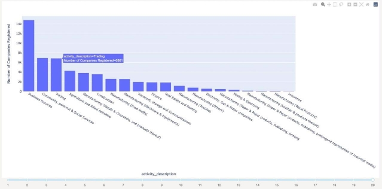

*Fig 14: Companies registered in each sector* 

These graphs show the comparison between the number of companies registered with different activity descriptions i.e. in different sectors. 

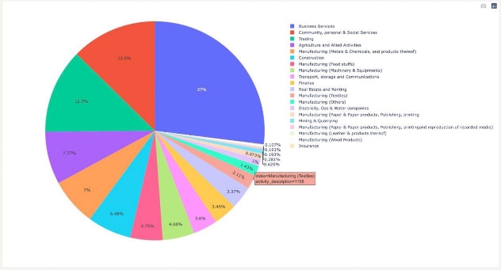

*Fig 15: Pie Chart for comparison of registered companies in each sector* 

It shows the percentage of companies with different activity description i.e. sector that were registered. 

We can clearly observe that maximum number of companies were registered in Business Services Sector from the above graphs (Bar Chart and Pie Chart). 

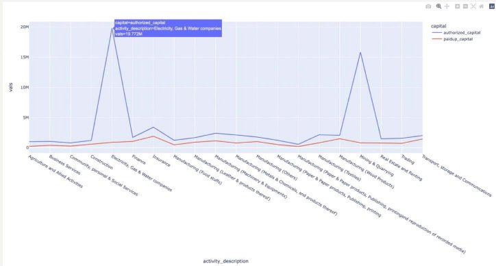

*Fig 16: Comparison of Authorized and Paid-up capital for all companies.* 

We can observe from the above graph that apart from two sectors (Electricity, Gas & Water Companies and Mining & Quarrying), the difference between authorized and paid-up capital is not that much which means that they have already generated most of the capital that they can but there is a lot of capital available that can be generated in Electricity, Gas & Water Companies and Mining & Quarrying. 

If we look at the above three plots we can observe that only 1% and 0.6% of total companies registered were in Electricity, Gas & Water Companies and Mining & Quarrying sectors respectively but the amount of capital left to be generated in these sectors is enormous, therefore these sectors have a lot of potential for future opportunities provided people can come up with new innovative ideas to make proper use of this potential. 

*Fig 17: Pie Chart for comparison of foreign companies registered in each sector* 

It shows the percentage of foreign companies with different activity description i.e. sector that were registered. 

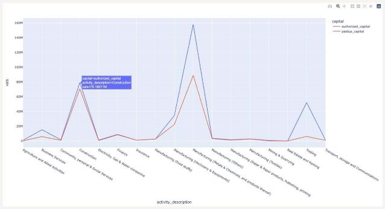

*Fig 18: Comparison of Authorized and Paid-up capital for Foreign companies.* 

This shows the difference between authorized and paid-up capitals of foreign companies. We can observe that for most of the sectors, authorized and paid- up capitals are same but in Business services there is a good difference between them indicating potential of growth in this sector for foreign companies. 
